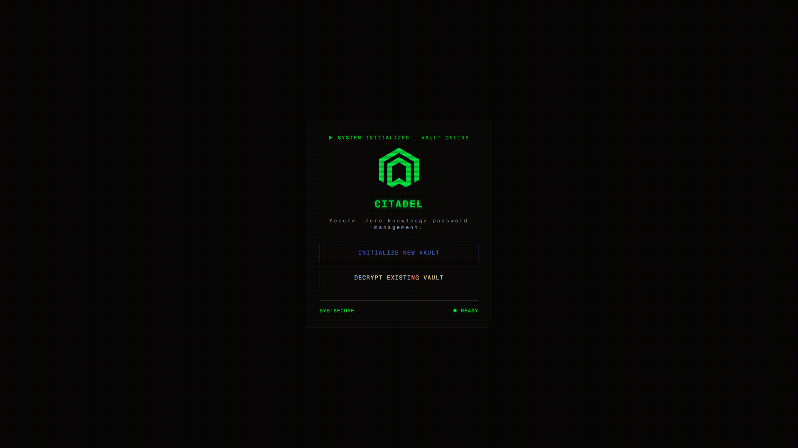
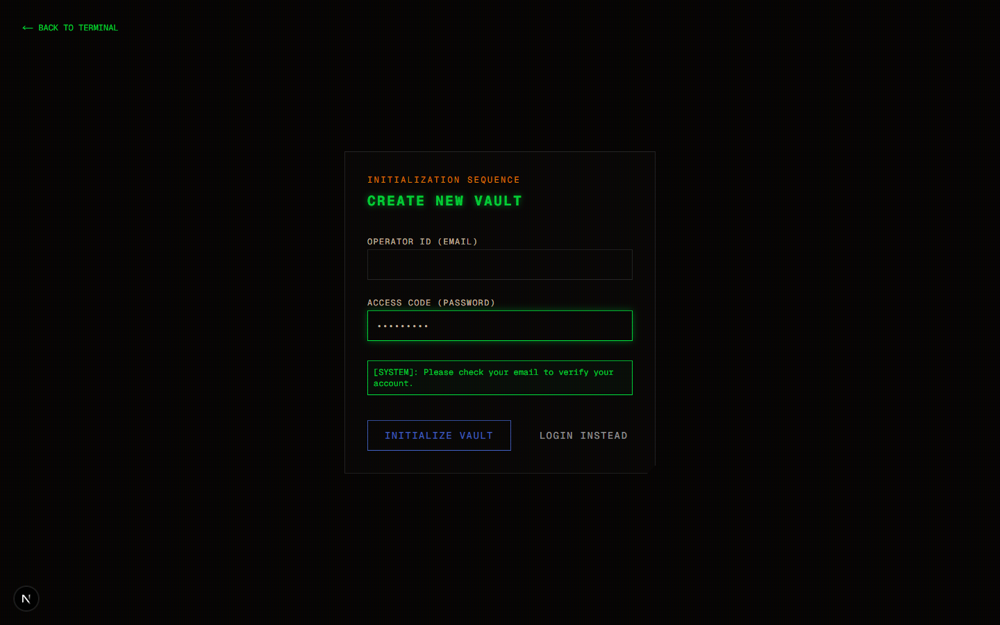

# Citadel Vault

Citadel is a secure, zero-knowledge password manager built with modern web technologies and a retro sci-fi aesthetic. 




## 🔒 Zero-Knowledge Architecture

Citadel is designed so that **only you** can read your passwords. 
* All sensitive data (passwords, usernames, folder names, notes) is encrypted **locally in your browser** using the standard Web Crypto API (AES-GCM encryption with PBKDF2 key derivation).
* The backend (Supabase) only stores the ciphertext and the Initialization Vectors (IVs).
* We never transmit or store your Master Password anywhere.

## 🛠 Tech Stack

* **Framework:** [Next.js 15](https://nextjs.org/) (App Router, Server Actions)
* **Styling:** [Tailwind CSS v4](https://tailwindcss.com/) with a custom brutalist sci-fi palette (`#00ed3f`, `#ff8800`, `#4466cc`)
* **Database & Auth:** [Supabase](https://supabase.com/) (PostgreSQL, Row Level Security)
* **Encryption:** Web Crypto API 

## 🚀 Getting Started

### 1. Prerequisites
* Node.js 18+
* A Supabase account and project

### 2. Environment Setup
Clone the repository and install dependencies:
```bash
git clone https://github.com/MukundhArul/Citadel.git
cd Citadel
npm install
```

Create a `.env.local` file in the root directory:
```env
NEXT_PUBLIC_SUPABASE_URL=your_supabase_project_url
NEXT_PUBLIC_SUPABASE_PUBLISHABLE_KEY=your_supabase_anon_key
```

### 3. Database Setup (Supabase)
Navigate to your Supabase SQL Editor and run the migration scripts found in the `supabase/migrations/` directory to set up the necessary tables and Row Level Security (RLS) policies.
1. Run `supabase/migrations/folders.sql` (Creates `vault_folders` and `vault_items` tables)
2. Run `supabase/migrations/fix_policies.sql` (Ensures RLS policies are strictly enforced)

### 4. Run the Application
Start the Next.js development server:
```bash
npm run dev
```
Open [http://localhost:3000](http://localhost:3000) in your browser to enter the Citadel.

## 🗂 Features
* **Zero-Knowledge Encryption:** End-to-end client-side encryption.
* **Operator Audit Logs:** Real-time tracking of your encrypted vault activity via a retro terminal UI.
* **Password Diagnostics:** Visual indicators for password strength and reuse warnings across your vault.
* **Dynamic Grid Interface:** Click any record to seamlessly expand it within a dense, masonry-like grid powered by smooth layout animations.
* **Folder Management:** Organize credentials seamlessly into encrypted folders.
* **One-Click Actions:** Quickly copy credentials or view hidden passwords securely.

## 🛡 Security Note
If you lose your Master Password, **your vault cannot be recovered**. The architecture is specifically designed to prevent decryption without the local derivation key.

---
*SYS:SECURE ● READY*
